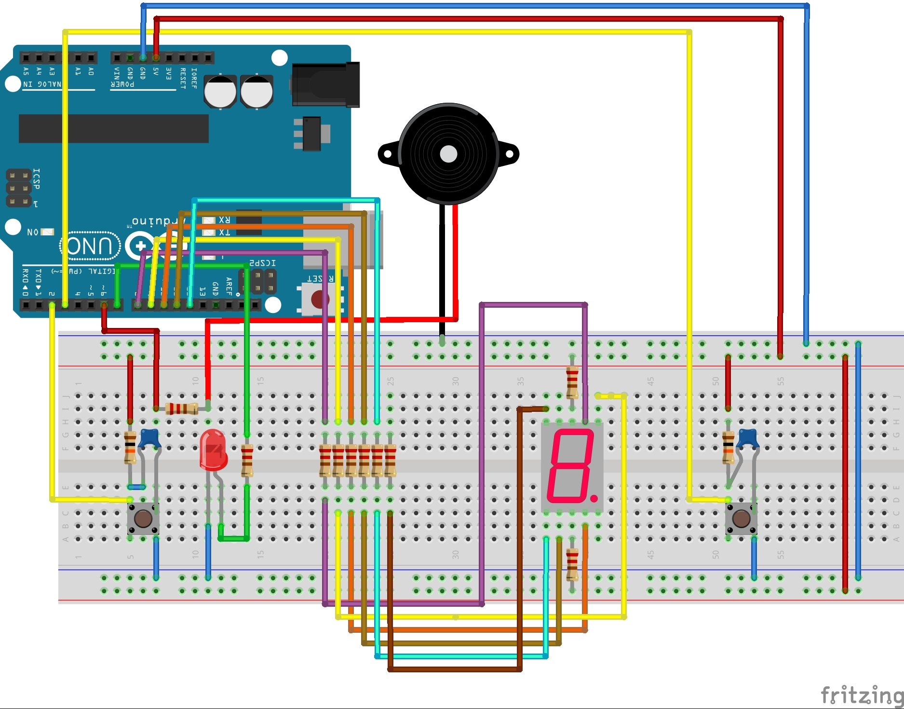
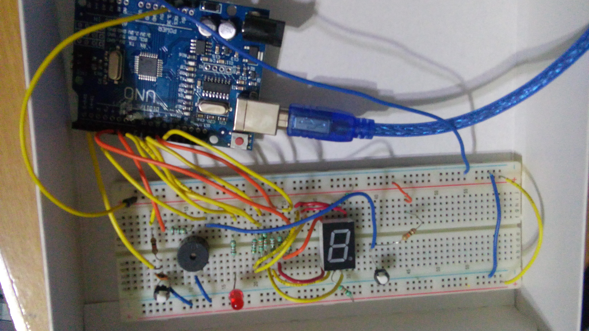
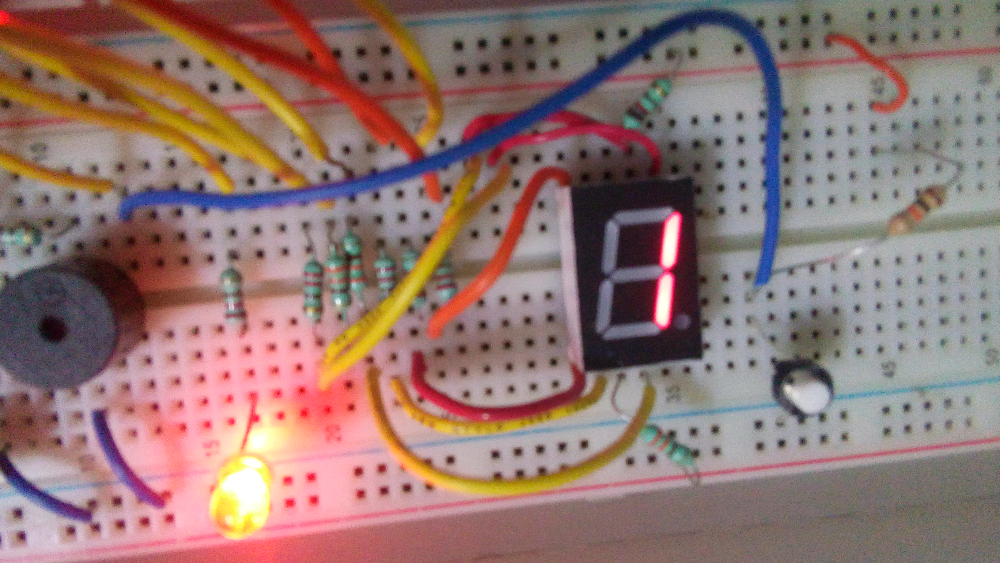
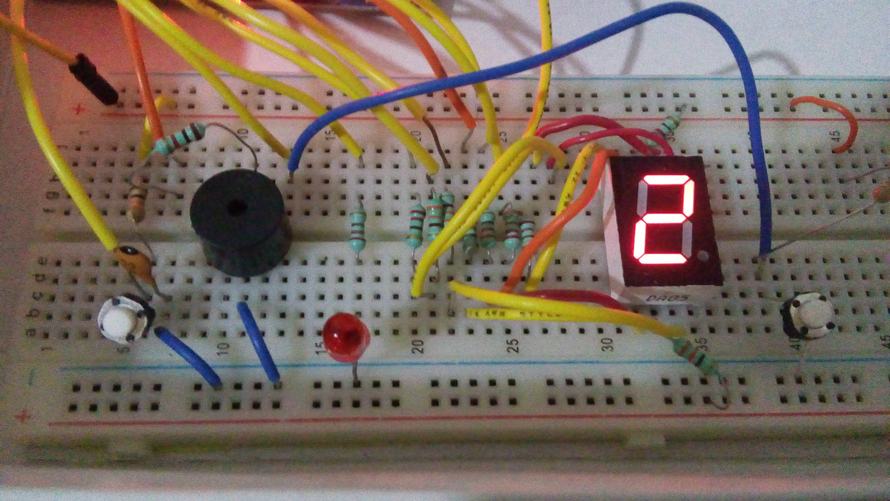
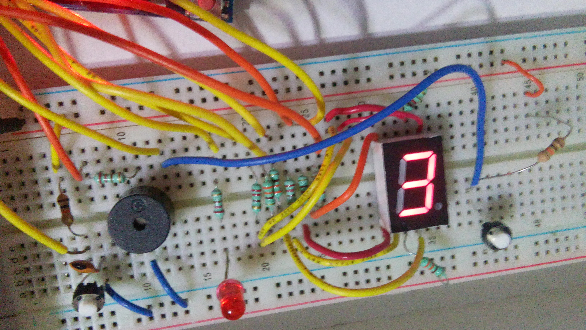
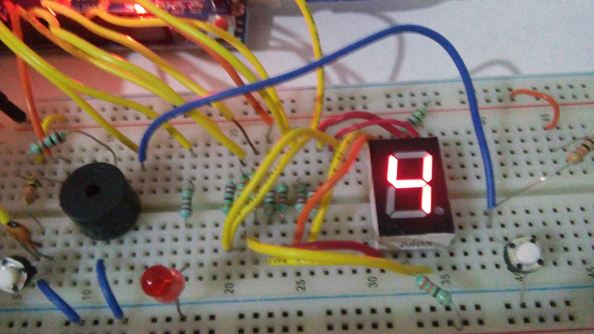

# Sistema Notificador de Llegada de Individuos


La práctica consiste diseñar en una alarma con arduino para el acceso a una puerta mediante un botón. Cuando la puerta se abra, la alarma deberá sonar.
Se tiene que reducir el consumo de energía al mínimo. Mientras la alarma no esté sonando el arduino deberá consumir la mínima cantidad de energía.
Cuando la puerta se cierre esta deberá de dejar de sonar y regresar al estado de bajo consumo energético. 
Se hace uso de interrupciones.
```
Funcionalidad extra: El sistema tiene 4 ritmos diferentes para la alarma. 
Se hace uso de un segundo botón (segunda interrupción) para cambiar el ritmo.
El display muestra el número del ritmo que actualmente se encuentra.
```
## Acerca del prototipo 📄
Las **interrupciones** son un mecanismo muy potente y valioso en procesadores y autómatas. Estas hacen que 
el procesador del arduino trabaje menos comparado con las acciones sin interrupciones.

Arduino dispone de dos tipos de eventos en los que definir interrupciones:
- Interrupciones de timers 
- Interrupciones de hardware (que responden a eventos ocurridos en ciertos pines físicos)

Dentro de las interrupciones de hardware, que son las que nos ocupan en esta entrada, Arduino es
capaz de detectar los siguientes eventos:

- RISING, ocurre en el flanco de subida de LOW a HIGH.
- FALLING, ocurre en el flanco de bajada de HIGH a LOW.
- CHANGING, ocurre cuando el pin cambia de estado (rising + falling).
- LOW, se ejecuta continuamente mientras está en estado LOW.

Para esta práctica hice uso del evento **RISING**, ya que como uso un botón, es necesario que el arduino 
detecte la interrupción cuando el botón pase de estado bajo a alto.

Muchos dispositivos físicos habitualmente generan ruido en los flancos de señal. Para reducir estos rebotes,
hice uso de **capacitores** conectados en paralelo de cada botón.


## Comenzando 🚀

A continuación se explicarán los pre-requisitos, material necesario, su instalación, etc.

### Pre-requisitos 📋

Para poder ejecutar satisfactoriamente el sistema se necesita de lo siguiente:

**Material físico**:
```
-1 placa arduino (UNO) con su cable para conectar
-1 protoboard
-1 led (rojo)
-10 resistencias de 220 Ohms
-2 resistencias de 10k
-1 buzzer
-2 Botones
-1 display de 7 segmentos (ánodo común)
-2 capacitores de 1uF
-Cables
```
**Software**:
```
-1 equipo con arduino IDE instalado
-Darle permisos dialout al usuario del equipo (Linux)
-Driver instalado de la placa (Windows)
```

### Instalación 🔧
#### Diagrama (protoboard)



Una vez se haya conectado los dispostivos como en el diagrama anterior, se procede a cargar y ejecutar el código.

#### Pasos para ejecutar el código
Para ejecutar el archivo.ino siga estos pasos:
- Abre el arduino IDE en tu equipo
- Carga en el IDE el archivo.ino
- Conecta la placa arduino a tu equipo
- Compila el código en el Arduino IDE
- Selecciona el puerto para la placa
```
    Ejemplo: /dev/ttyUSB
```
- Carga el programa a la placa arduino
- Listo <br />

## Explicación
Para abrir o cerrar la puerta se tiene que oprimir el botón 1, el cual es el que está situado más cerca del buzzer y 
del led (en el diagrama). Al abrirse al puerta (pulsar una vez el botón) se activará la alarma y esta sonará de acuerdo
al ritmo actual de la alarma. Al cerrarse la puerta (pulsar nuevamente el botón), la alarma dejará de sonar permitiendo 
al arduino seguir con su actividad, en este caso a pasar a bajo consumo. 

Inicialmente el ritmo es 1 (se puede visualizar en el display), y se puede cambiar mediante el otro botón (situado más 
caerca del display de 7 segmentos). Cada que se presiona ese segundo botón, hace cambiar el ritmo, como tiene 4 ritmos:
del ritmo 1 pasará al 2, y de este al 3, y posteriormente al 4, para que finalmente se reinicie la secuencia.

Los ritmos son los siguientes:
1. Un constante prendido y apagado (rápido)
2. 2 pulsos y una pausa ligera
3. Un pulso duradero, una pausa
4. Una melodía al azar, es decir, frecuencias aleatorias

## Construido con 🛠️

Arduino IDE (Código y compilación) <br />

* [Arduino](http://www.arduino.cc/)

Fritzing (Elaboración del diagrama)

* [Fritzing](fritzing.org/home/) <br />

## Resultados 📌

**Conexión en físico**

 <br />

**Display cada que se presiona el botón para cambiar la secuencia rítmica de la alarma**








## Autor ✒️

* **Jorge Enrique Aguado Guaní** - [jorgeguani](https://github.com/JorgeGuani)
